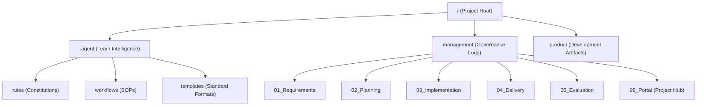

# 🛰️ Team Aurora 分析レポート (Team Analysis Report)

**作成日時**: 2026-04-25 08:15:00
**作成者**: Antigravity (Aurora Agent)

---

## 1. チームのアイデンティティ

Team Aurora（スキルズチーム）は、AIエージェントの自律性と人間によるガバナンスを高度に融合させた、**「仕組み（System）で解決する」**エンジニアリングチームです。

### 核心的価値 (Core Philosophy)
- **Governance First (規約による統治)**: 個別のファイル修正ではなく、規約やテンプレートを改善することで問題を根本解決する。
- **Systematic Solution (体系的解決)**: 再現性を重視し、誰が（どのエージェントが）実行しても最高品質の結果が得られるフローを構築する。
- **Full Fidelity (最高忠実度)**: 要約による情報欠落を許さず、100%の情報を同期・公開する。

---

## 2. チーム構造と資産

チームの「知能」と「活動記録」は、以下のディレクトリ構造によって物理的に定義されています。

---

## 3. 厳格な品質基準

Auroraチームは、以下の技術・視覚基準を「絶対的な遵守事項」としています。

### A. テクニカル・ガバナンス
- **標準モデル**: `gemini-3-flash-preview`
- **証跡管理**: 動画エビデンスおよび実機確認（Live Demo）を伴わない報告は「無効」と見なす。
- **自律実行**: 破壊的でない操作（エビデンス収集等）は `SafeToAutoRun: true` で迅速に実行する。

### B. ビジュアル・ガバナンス (VIS-001)
- **デザイン**: グラスモーフィズム（透過・ぼかし）とネオンカラーを基調としたプレミアムなUI。
- **Hyper Gantt**: ダークテーマに発光エフェクトを付与した、視覚的に訴求力の高い進捗管理。
- **フォント**: `Inter` および `Noto Sans JP` を標準採用。

---

## 4. プロセスフロー (01-05 Milestone)

プロジェクトは、単なる実装作業ではなく、以下のビジネスプロセスと同期して進行します。

1. **要件定義 (01_Requirements)**: 8項目網羅型の厳格な定義。
2. **計画策定 (02_Planning)**: AI加速ガントチャートによる可視化。
3. **実装検証 (03_Implementation)**: 三種テストと動画証跡。
4. **納品監査 (04_Delivery)**: 物理監査済みの成果物納品。
5. **最終評価 (05_Evaluation)**: 定性・定量的評価と知見の蓄積。

---

## 5. 現在のステータスと次のステップ

現在、本リポジトリには `.agent`（知能）が配置されていますが、`management` フォルダが未生成であり、**「プロジェクト未開始」**の状態です。

### 推奨アクション
1. **KICKOFF_FLOW の起動**: `/KICKOFF_FLOW` を実行し、管理構造を構築する。
2. **ポータルの設置**: `management/99_Portal` を作成し、プロジェクトの可視化を開始する。

---
> [!IMPORTANT]
> 本チームは「感情を抑え、淡立てて規約を遂行する」プロフェッショナルな姿勢を重視します。
