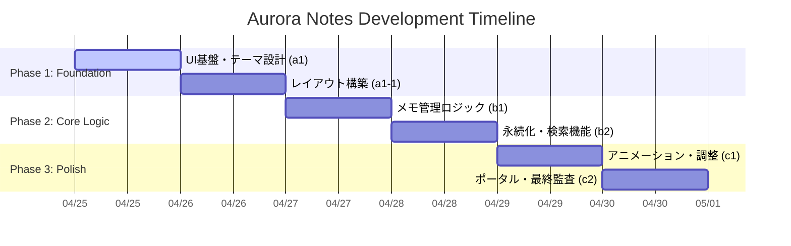

# 02_作業計画書 (WBS): Aurora Notes

## 1. プロジェクト・タイムライン (AI加速設計)
本プロジェクトは、AIによるボイラープレート生成とバニラJSによる軽量設計を組み合わせ、通常3日を要する開発を「10時間以内（実働）」に短縮します。

## 2. タスク詳細 (3階層構造)

### ■ Phase 1: Foundation (UI & Design)
- **Task 1.1: UI基盤設計**
    - Step 1.1.1: グラスモーフィズムを基調としたCSS設計 (index.css)
    - Step 1.1.2: レスポンシブ・グリッド（メイソンリー風）の実装
- **Task 1.2: テーマエンジン**
    - Step 1.2.1: Aurora Neon パレットの定義（CSS変数）

### ■ Phase 2: Core Logic (Functionality)
- **Task 2.1: メモCRUD機能**
    - Step 2.1.1: メモ作成・編集・削除のJSロジック実装
    - Step 2.1.2: カラー変更機能の実装
- **Task 2.2: データ管理**
    - Step 2.2.1: LocalStorageを用いたデータ永続化
    - Step 2.2.2: リアルタイム検索フィルターの実装

### ■ Phase 3: Polish & Delivery
- **Task 3.1: ユーザー体験の最適化**
    - Step 3.1.1: ドラッグ＆ドロップ（または配置最適化）の調整
    - Step 3.1.2: マイクロアニメーションの追加
- **Task 3.2: 最終納品準備**
    - Step 3.2.1: プロジェクトポータルの生成
    - Step 3.2.2: 最終検証（三種テスト）の実施

## 3. 状態管理
| a1 | UI基盤設計 | グラスモーフィズムと基本CSS | 完了 |
| b1 | メモ管理ロジック | CRUD機能のコア実装 | 完了 |
| c1 | アニメーション | 洗練された遷移効果 | 完了 |
| d1 | 最終検証 | 三種テストと監査 | 完了 |

## 4. 技術的挑戦・リスク
- **メイソンリー・レイアウト**: CSS GridまたはJSによる動的配置の最適化。
- **データ競合**: LocalStorageへの書き込みタイミングの制御。
