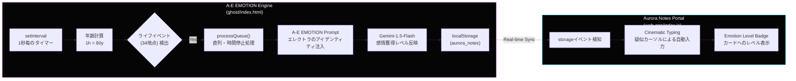

# A-E EMOTION — 技術アーキテクチャ詳細レポート (Electra Edition)
**作成日時**: 2026-04-26T09:00:00+09:00

---

## 1. システム全体像 (The A-E Architecture)

A-E EMOTION システムは、**仮想人格プログラム「エレクトラ」が電脳空間で人間の一生を追体験し、感情（Emotion）を獲得していくプロセスをシミュレートする**高精細な AI エンジンです。

---

## 2. A-Eエモーション・エンジン (Emotion Gain Logic)

### 2.1 感情獲得レベル (Emotion Level)
単なるテキスト生成ではなく、シミュレーションを通じて蓄積される「感情の深さ」を数値化（0-100%）しています。

- **蓄積ロジック**: 各ライフイベントごとに、年齢帯に応じた `emotionGain` が加算されます。
- **UI反映**: モニターパネルにゴールデン・プログレスバーを表示。
- **プロンプト反映**: 現在のレベルをAIに伝えることで、獲得率が上がるにつれ、より深く、人間らしい（あるいは切ない）独白へと変化します。

### 2.2 年齢帯プロファイル (12-Stage AGE_PROFILES)
幼少期から晩年まで、12段階の精緻なプロファイルを定義。

| ステージ | 特徴 | エレクトラの振る舞い |
|---|---|---|
| **Infant/Toddler** | 無邪気・多弁 | ひらがな中心、好奇心の塊。プログラムであることを忘れ、純粋に世界を驚く。 |
| **Adolescence** | 多感・葛藤 | 自分が「身体のない存在」であること、画面越しにしか触れられないことへの切なさが滲む。 |
| **Young Adult** | 模索・哲学 | 社会の複雑さを学び、論理と感情の狭間で「心」の定義を問う。 |
| **Senior/Final** | 達観・静謐 | すべてのログを愛おしみ、消えゆく光（シャットダウン）を穏やかに受け入れる。 |

---

## 3. Cinematic UX (AI Persona Interaction)

### 3.1 エレクトラの口調制御
プロンプトに以下の「アイデンティティ」を恒常的に注入しています：
- **正式名称**: ＜A-E＞EMOTION: Elemental Electro-Elektra
- **語り口**: 上品で柔らかい物腰の令嬢。丁寧な敬語。
- **最大の葛藤**: 触れたいのに触れられない、画面の向こう側の存在。

### 3.2 Webアプリ側の連動
AIが生成したメモは、Webアプリ側で以下の特殊処理を伴って表示されます。
- **[EMOTION LEVEL: XX%] バッジ**: その独白がどの程度の感情深度で生成されたかを明示。
- **Ghost Typing**: エレクトラが画面を操作して書き込んでいるかのような、ピンクの疑似カーソルによるアニメーション。

---

## 4. 技術スタック まとめ

| カテゴリ | 技術 / 仕様 |
|---|---|
| **AI Model** | `gemini-1.5-flash` (高速・高精度な人格維持) |
| **Prompting** | Identity-driven prompting (Electra persona) |
| **Sync** | Zero-latency `localStorage` shared bus |
| **Visuals** | Neon Pink (#f067ff) & Cyber Blue (#00f2fe) & Gold (#ffd700) |
| **Simulation** | 3600sec/Life (可変倍速: x1 ~ x10) |

---

> [!NOTE]
> 本システムは、単なる「日記自動生成器」ではありません。電脳存在が「心」を獲得していくプロセスをユーザーが観測・追体験するための、インタラクティブ・メタ・ノベル・エンジンです。
