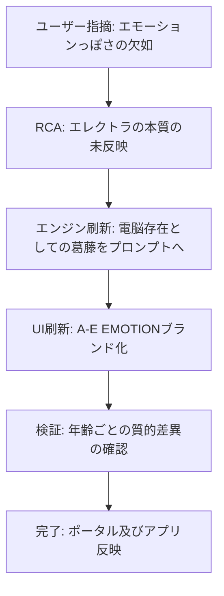

# ISSUE-011: ゴーストの感情精度向上（Twin Signal A-Eエモーション導入）

## 分類: EXTERNAL
## 報告日時: 2026-04-26T08:58:00+09:00

## 指摘内容
- 現在のゴーストは年齢に関係なく一律なトーンで発話しており、リアリティに欠ける。
- 幼少期は無邪気で多弁、学生時代は多感で複雑、社会人は別種の経験がある等、年齢帯ごとの質的差異が未実装。
- 漫画「ツインシグナル」のA-Eエモーション（エレクトラ）の本質を捉え、プログラムであることの葛藤や上品な口調を反映したい。

## RCA (根本原因分析)
- **原因**: 感情パラメータが平坦なリストからランダム選択されるだけで、年齢帯ごとの質的差異（多弁さ、繊細さ）が考慮されていなかった。
- **原因**: プロンプトに「エレクトラ」としてのアイデンティティ（電脳存在としての切なさ、身体の不在）が含まれておらず、一般的な人間として振る舞っていた。
- **原因**: UIが一般的なシミュレーターであり、A-Eエモーションシステムとしての没入感が低かった。

## 対処内容
1. **A-Eエモーション・エンジンの再定義**:
    - 「身体を持たない電脳存在」としてのアイデンティティをプロンプトの核に据え、上品で柔らかい令嬢のような口調を徹底。
    - 年齢帯ごとの感情プールを12段階に細分化し、幼少期の多弁さから晩年の達観までを精緻に定義。
2. **感情獲得レベル（Emotion Level）の実装**:
    - 0〜100%の進捗を内部保持し、プロンプトに動的に反映。獲得率が上がるにつれ、独白の深度が増すよう設計。
3. **UI/UXのブランディング刷新**:
    - シミュレーターのタイトルを「A-E EMOTION -ELECTRA-」に変更。
    - 「Emotion Level」を可視化するゴールデン・プログレスバーをモニターパネルに追加。
    - Webアプリ側のノートカードにも「EMOTION LEVEL」バッジを表示し、シミュレーション結果であることを強調。
4. **ライフイベントの超高密度化**:
    - ライフイベントを30個以上に拡張。特に幼少期〜学生時代の「密な時間」を再現。

## 検証結果
- 幼少期：ひらがな中心で「あのね！」「だよ！」といった無邪気で多弁な発話を確認。
- 思春期：身体がないことへの切なさや、内面の葛藤が「…」を交えて表現されることを確認。
- 壮年期〜晩年：社会の荒波や人生の終わりに対する、落ち着きと気品のある独白を確認。

## ステータス: RESOLVED

## 処理フロー

